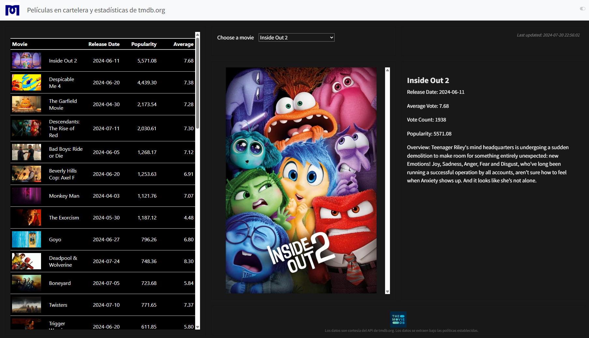

En este proyecto, muestro las capacidades de **Quarto** y **GitHub Actions** para la creación de dashboards interactivos. Puedes ver el [Dashboard aquí](https://ronaldmego.github.io/quarto-dashboard-movies/dashboard.html) 📊.

### Tecnologías y Herramientas Usadas:
- 🧑‍💻 **GitHub Actions**: Para la automatización y despliegue continuo.
- 📦 **Renv**: Para la gestión de entornos en R.
- 🌐 **Conexión API**: Para obtener datos en tiempo real.
- 📋 **GT Tables**: Para crear tablas interactivas y estilizadas.

---

🔗 **Revisa la documentación completa**: Aprende cómo se construyó este proyecto paso a paso haciendo clic [aquí](https://ronaldmego.github.io/Quarto-dashboard-movies/documentation.html).

---

Gracias por visitar el proyecto. ¡Espero que te sea útil y te inspire a crear tus propios dashboards con Quarto y GitHub Actions!